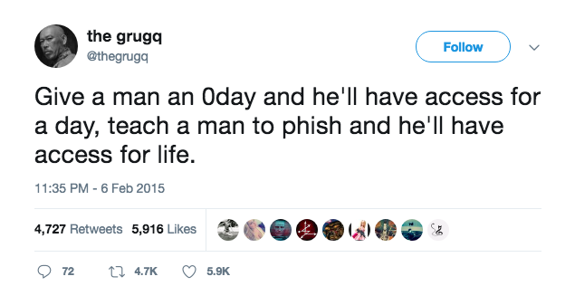

[](https://twitter.com/thegrugq/status/563964286783877121)

# Let's Make a Phishing Site!

   * Google Chrome
     * Command-Shift-N: Open an Incognito Window
     * https://home.nyu.edu
     * Redirected to https://shibboleth.nyu.edu/idp/profile/SAML2/...
     * Command-S: Save As
   * Command-Space: Search "Terminal"
     * cd "~/Downloads"
     * python -m SimpleHTTPServer 8000
   * Google Chrome
     * Command-T: New Tab
     * http://localhost:8000/NYU%20Login.htm
     * Now what do you notice?

# Let's Make This Nastier!

```
$ diff -u "NYU Login.htm" "NYU Login-PATCHED.htm"
--- NYU Login.htm    2017-09-05 22:32:04.000000000 -0400
+++ NYU Login-PATCHED.htm    2017-09-05 22:53:24.000000000 -0400
@@ -133,7 +133,7 @@

             <section class="col col2">
                 <div class="login">
-                    <form action="https://shibboleth.nyu.edu/idp/profile/SAML2/POST/SSO?execution=e1s1" method="post" name="login" id="login">
+                    <form action="/" method="post" name="login" id="login">
                         <h1>NYU Login</h1>
                                                                           <p>
                             <strong>Login to NYUHome</strong>
```

```
$ python server.py
```

# Let's Do This Over the Network!

```
$ ifconfig en0
en0: flags=8863<UP,BROADCAST,SMART,RUNNING,SIMPLEX,MULTICAST> mtu 1500
        options=10b<RXCSUM,TXCSUM,VLAN_HWTAGGING,AV>
        ether 38:c9:86:32:ec:ec
        inet6 fe80::3ac9:86ff:fe32:ecec%en0 prefixlen 64 scopeid 0x4
        inet 192.168.119.220 netmask 0xffffff00 broadcast 192.168.119.255
        nd6 options=1<PERFORMNUD>
        media: autoselect (1000baseT <full-duplex>)
        status: active
```
